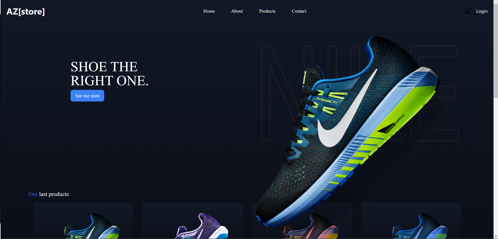
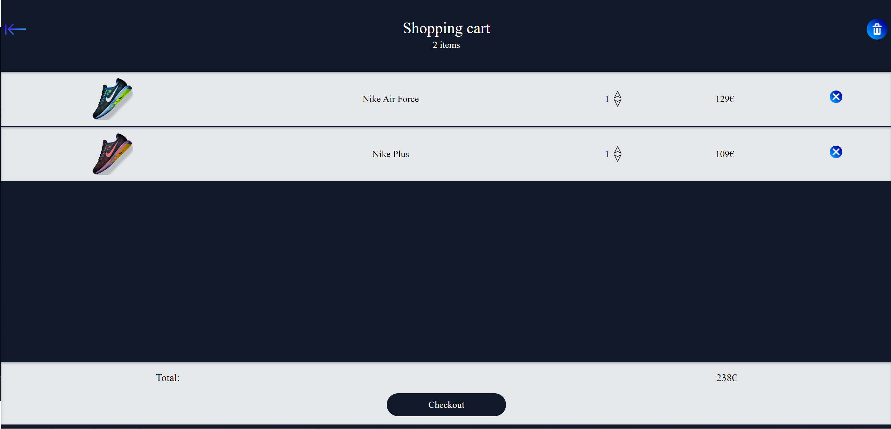
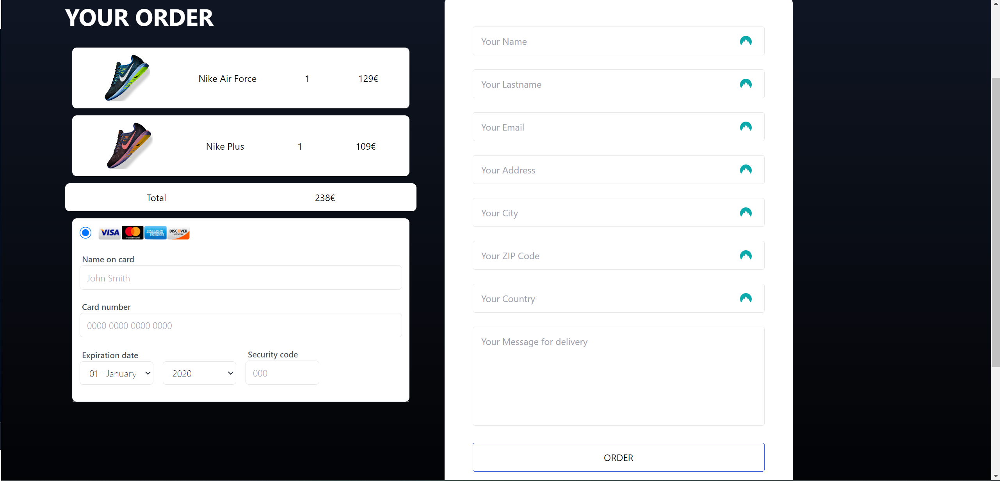

# AZ-Store

You are a web developer for a web agency and your boss has asked you to create a small shopping cart for a website of a client (see below). The shopping cart should be able to add and remove products. The shopping cart should also be able to display the total price of the products in it.

## Screenshots






## Badges

[](https://choosealicense.com/licenses/mit/)
[](https://choosealicense.com/licenses/mit/)
[](https://choosealicense.com/licenses/mit/)

## Run Locally

Clone the project

Go to the project directory

Start the server

```bash
  php -S localhost:8000
```


## work progress

This project was made in October 2023 during a formation at BeCode. 

## Authors

- [@Mathias](https://github.com/PAZTEK1007)
- [@Bastien](https://github.com/bastien-venturi)
- And me


